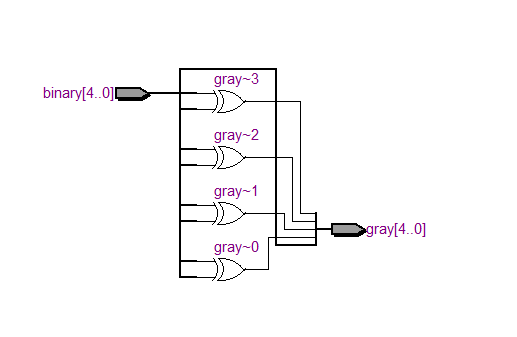

# TITTLE 
Design and simulate 5 bit binary to gray converter using Verilog.
# THEORY

A Gray code, also known as a reflected binary code, is a binary numeral system where consecutive values differ by only one bit. The purpose of a binary to Gray code converter is to convert a binary number into its corresponding Gray code representation.

In general, a binary to Gray code converter takes an n-bit binary input and generates an n-bit Gray code output. Each bit in the output is determined by the current bit and the previous bit in the binary input.

The conversion from binary to Gray code can be achieved using a recursive algorithm. The algorithm follows these steps:

1.Start with the most significant bit (MSB) of the binary input. Assign this bit directly to the MSB of the Gray code output since there is no previous bit to consider.

2.For the remaining bits, proceed from left to right in the binary input.

3.To determine the corresponding bit in the Gray code output, perform an XOR operation between the current bit and the previous bit in the binary input. This XOR operation represents the Gray code conversion rule.

4.Assign the result of the XOR operation to the corresponding bit in the Gray code output.

# LOGIC DIAGRAM


# NETLIST DIAGRAM



# TIMING DIAGRAM


# PROGRAM
### Developed By:Aadheeshwar.A
### REGISTER NUMBER : 212221230001
```
module BinaryToGray (
  input [4:0] binary,
  output [4:0] gray
);

  assign gray[0] = binary[0];
  assign gray[1] = binary[1] ^ binary[0];
  assign gray[2] = binary[2] ^ binary[1];
  assign gray[3] = binary[3] ^ binary[2];
  assign gray[4] = binary[4] ^ binary[3];

endmodule
```
# REFERENCE
https://github.com/Aadheeshwar-AIDS/Simulation-project--Digital-Electronics.git
